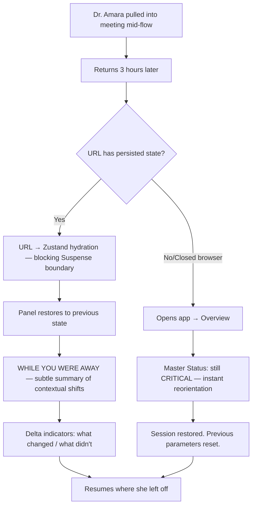
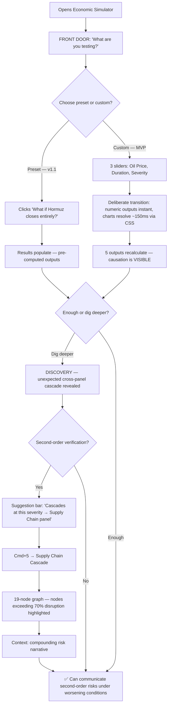
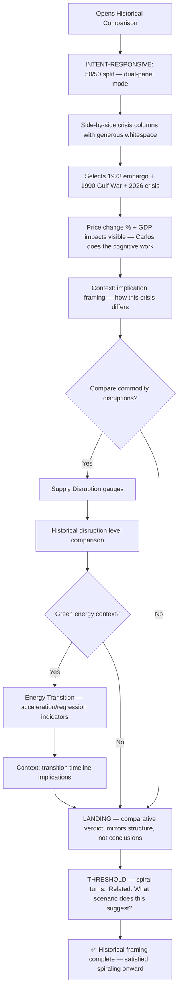
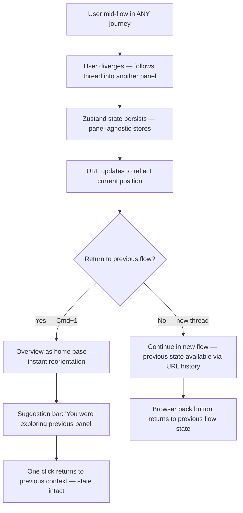

# UX Design Specification — Global Energy Crisis Command Center

**Author:** Team Mantis B
**Date:** 2026-04-12

---

<!-- UX design content will be appended sequentially through collaborative workflow steps -->

## Executive Summary

### Project Vision

The Global Energy Crisis Command Center is a single-page, zero-backend interactive web application that consolidates economic analysis of the 2026 energy crisis into one dark-themed command center view. Fourteen analytical panels span supply dynamics, macro impacts, scenario modeling, and supply chain cascades — all powered by static embedded data with zero API calls. The product fills a gap no existing tool addresses: an integrated, interactive, free, offline-capable view of the full crisis picture.

### Target Users

| Persona | Role | Core Need | Success Metric |
|---------|------|-----------|----------------|
| **Dr. Amara** | Policy Analyst (IMF Energy Division) | Rapid macro synthesis for morning briefings — scenario comparison, export-ready insights | Complete crisis picture in <5 min, 2 interactions to GDP exposure |
| **Carlos** | Journalist (Reuters Energy Correspondent) | Citable data with source attribution, visual evidence for articles | Verified data points for an article in <10 min |
| **Secondary** | Economists, students, investors, informed public | Single integrated crisis view | Self-directed exploration |

### Key Design Challenges

1. **14-panel navigability** — Preventing user overwhelm with 14 tabs in a horizontal scrollable strip. Users must find relevant panels quickly without getting lost.
2. **Information density vs. scanability** — Panels pack dense data (8-region grids, 19-node graphs, 8 macro indicators). The dark command center aesthetic must serve clarity, not just drama.
3. **Cross-panel cognitive threading** — Users like Dr. Amara flow across 4+ panels in a single session. Supporting mental continuity between tabs (e.g., simulator findings → cascade verification) without explicit linking.
4. **Touch/mobile at 375px** — 19-node graph, dual-bar grids, and 3-slider simulators must remain usable on small touch screens.
5. **Data trust signals** — Users need to instantly gauge data freshness and source credibility (especially Carlos the journalist verifying data points).

### Design Opportunities

1. **Progressive disclosure via tab grouping** — Overview-first, then analytical tools, then reference data. Tab order already defined in PRD — UX can reinforce this with visual grouping cues.
2. **Persona-aware defaults** — Landing on Overview with 6 KPI cards gives both personas their "quick answer" within seconds, matching SC-01 (GDP exposure in 30s) and SC-02 (scenario comparison).
3. **Command center aesthetic as trust signal** — Dark, data-forward design projects authority and seriousness matching the crisis context. When done right, the aesthetic IS the UX — users feel they are looking at a professional intelligence tool, not a dashboard toy.

## Core User Experience

### Defining Experience

The core experience is **answering a pressing question about the crisis under real-world pressure**. The primary loop is: **Question → Locate → Extract → Act**. Dr. Amara at 6:47 AM with coffee in one hand needs to feel she can breathe within 3 seconds of opening the tool. Carlos on a 47-minute deadline needs to confirm or kill a hunch before his editor asks again. The tool helps users *formulate* questions as much as answer them — transforming anxiety into confidence, hunches into citable facts.

### Platform Strategy

Web-only single-file SPA. Desktop-first (1280px+) with mobile responsive down to 375px. Mouse/keyboard as primary input, touch as secondary. Offline-capable with zero network dependency after initial load. No native apps, no installation, no authentication. Keyboard navigation mandatory per WCAG 2.1 AA. Navigation model owns both `activeTab` and `navStructure` to support potential grouping without touching 14 panel components.

### Effortless Interactions

- **Landing orientation** — Overview KPI cards + briefing give the headline picture in <10 seconds; the first 3 seconds answer "can I trust this?" and "does it cover what I need?"
- **Tab navigation** — Finding the right panel among 14 should feel like turning your head, not walking to another building. Grouped, labeled, scannable.
- **Data point reading** — Hover/tap any chart element and get the exact number with source attribution instantly
- **Simulator feedback** — Drag a slider, all 5 outputs recalculate within 100ms — the tool feels *alive*
- **Cross-panel flow** — Moving between panels should maintain cognitive continuity, not force users to remember what they saw two tabs ago
- **Data trust** — Source attribution and freshness visible at a glance on every panel

### Critical Success Moments

1. **First 3 seconds** — Overview KPI cards communicate credibility, completeness, and "you're safe, I've got you" — the user exhales
2. **First tab switch** — Panel transition feels fast and connected, not a page load; the spatial model starts forming
3. **Simulator first drag** — Real-time recalculation creates the "this is a tool, not a report" moment (SC-04)
4. **Cascade node selection** — Tracing Hormuz → fertilizer → food prices in ≤4 clicks reveals the invisible (SC-03)
5. **Data source attribution** — "Source: IEA" next to a number builds immediate trust; Carlos can cite it without opening a second browser tab
6. **First extraction** — The moment a user pulls a finding out of the tool (copies a number, screenshots a chart, reads a value aloud for a briefing). Currently limited to manual extraction in MVP; Phase 2 should formalize export/share within 2 clicks of any insight.

### Experience Principles

1. **Answer-first design** — Every panel leads with the answer. Context and sources follow. Users never hunt for the key insight. Panels frame "what matters right now," not just present raw data.
2. **Instantaneous first value** — The very first interaction delivers value before the user has learned anything. Progressive disclosure handles depth: zero learning for the first question, growing mastery for the fifth.
3. **Dense but not overwhelming** — Command center density is a feature, but every pixel earns its place. Operational test: no panel requires scrolling to reach its primary insight at 1440×900. Details cascade or expand on demand. If a panel needs vertical scroll for its core message, it fails.
4. **Credibility through transparency** — Source attribution, timestamps, staleness indicators. Trust through honesty about data currency and origin. Every number traceable to its source.
5. **Active problem-solving, not passive consumption** — The tool helps users formulate questions, compare scenarios, trace cascades, and extract actionable findings. It is a tool for producing deliverables (briefings, articles), not just reading dashboards.

## Desired Emotional Response

### Primary Emotional Goals

The product transforms crisis overwhelm into composed, actionable understanding. Users arrive under pressure (morning briefings, article deadlines) and need to leave *not blindsided*. The four target emotions:

1. **Composure** — "I am grounded and clear-headed enough to act well, even amid uncertainty. I know what I know, what I don't know, and what to do with both."
2. **Recognition** — "Ah. Now I SEE." The tool reveals patterns from chaos — it doesn't just soothe, it illuminates.
3. **Curiosity** — "Wait, what happens if I trace this further?" The tool provokes better questions, not just answers.
4. **Trust through curated confidence** — "This is the number, here's why, here's how confident we are. I can use this."

### Emotional Journey Mapping

The journey is not linear — it is a **breathing rhythm** of contraction and expansion: **Contract → Expand → Contract → Expand**

| Stage | Emotional State | What Happens |
|-------|----------------|--------------|
| **Arrival** | Overwhelm / Triage mode | User arrives under real pressure — not clean "anxiety" but cognitive overload with performative confidence requirements |
| **First expansion** | Recognition | Overview KPIs reveal the picture. "Now I see." Patterns emerge from chaos. |
| **Contraction** | Focused tension | User dives into a specific panel. Encounters complexity. Staleness badge, conflicting signal, a number worse than expected. |
| **Second expansion** | Composure through agency | Simulator drag, cascade trace, scenario comparison. The tool becomes an instrument, not just a display. |
| **Final state** | Prepared, not blindsided | User leaves knowing they can defend their analysis, cite their sources, and answer the hard question they'll be asked. |

**Persona-specific grounding:**

- **Dr. Amara** needs to avoid being blindsided at the 7 AM briefing. The face she's making at 6:47 AM is *triage*. The tool's job: make the unknown known before the Secretary asks about it.
- **Carlos** needs to not be wrong in print. The face he's making at his desk is *professional fear*. The tool's job: let him say "yes" when his editor asks "are you sure?" without hesitation.

### Micro-Emotions

| Target Emotion | Defeated Emotion | Design Mechanism |
|---------------|-----------------|-----------------|
| Composure | Panic/Overwhelm | Above-the-fold primary insight per panel; triage signal — "how bad, do I need to act now?" |
| Recognition | Confusion | Data visualizations that reveal patterns, not just present numbers |
| Trust | Skepticism | Curated confidence: source + timestamp + confidence level in plain language |
| Accomplishment | Frustration | ≤4 clicks to trace cascades; <100ms simulator response |
| Curiosity | Passive consumption | Cascade explorer pulls users deeper; simulator invites "what if" |
| Safety to experiment | Fear of being wrong | Simulator signals "experiment freely" — no commitment, no saved state, instant reset |

### Emotions to Avoid

- **Doubt** — "Is this number right?" → Prevented by source attribution that *curates* confidence, not drowning in uncertainty
- **Lostness** — "Where do I find X?" → Prevented by logical tab grouping and scannable labels
- **False mastery** — "I feel in control but I'm actually missing something" → Prevented by honest staleness indicators and "Estimated" labels; the tool shows its limits
- **Claustrophobia** — "Too much on screen" → Prevented by above-the-fold rule and progressive disclosure as emotional scaffolding (headline → confidence level → provenance → raw data)

### Emotional Design Principles

1. **Crisis-appropriate gravity** — The aesthetic matches the subject matter. No playful animations, no celebratory colors. Red for danger, amber for warning, green for baseline. Every visual choice reinforces seriousness. Where data reveals injustice or alarming trends, the interface should let that land — not sanitize it.
2. **Curated confidence, not transparency overload** — Show the seams, but frame them. "Source: IEA, as of April 11" is curated confidence. "95% confidence interval of ±2.3% based on 47 observations" is transparency that paralyzes. Give users what they need to *use* the data, not everything we know about it.
3. **Speed as respect** — Users are under pressure. Every millisecond of latency is disrespect. Static data + <100ms computation = the tool respects the user's urgency and cognitive state.
4. **Agency as instrument, not illusion** — Users don't control the crisis. They control their *response* to it. The simulator, cascade explorer, and scenario comparison give users instruments for understanding, not illusions of mastery. The tool says: "here's what we know, here's what could happen, here's what to watch."
5. **Cyclical emotional rhythm** — Design for the breathing pattern of crisis work. Every panel should enable quick contraction (find the number) and rewarding expansion (understand the context). Progressive disclosure as emotional scaffolding: first click = headline, second = confidence, third = provenance, fourth = raw data. Each layer rewards the click; none is required.

## UX Pattern Analysis & Inspiration

### Inspiring Products Analysis

**Bloomberg Terminal** — Professional command center density at $25K/year. Every pixel answers a question. Users tolerate extreme density because it saves time. The density IS the UX. Power users navigate with keyboard shortcuts, not clicks. Our dark theme + 14-panel density mirrors this philosophy, but Bloomberg's steep learning curve is a cautionary tale.

**EIA Short-Term Energy Outlook** — Authoritative, sourced, no-nonsense data presentation. Clean tables with clear source attribution. No decoration — the data speaks. Our source attribution and data freshness model follows this pattern. What EIA lacks (interactivity, integrated view, simulation) is exactly what we add.

**Our World in Data** — Interactive charts with hover-to-explore data points. Every chart has source citation visible at rest. Accessibility-focused. Progressive disclosure via chart interaction — you see the trend, then hover for exact values. Our tooltip model for charts and always-visible source badges follow this pattern.

**Nomic Atlas / UMAP Visualizations** — Node-graph exploration where clicking reveals structure. Fixed spatial layout builds spatial memory. Our Supply Chain Cascade (19-node graph) applies this: fixed positions, click-to-trace, animated directional flow along edges.

### Transferable UX Patterns

| Category | Pattern | Application | Risk Level |
|----------|---------|-------------|------------|
| **Navigation** | Tab-based single-focus (one panel active) | 14 tabs, lazy-render, one panel visible at a time | Low |
| **Navigation** | Logical grouping with visual separators | Overview → Analysis → Tools → Reference — spatial clusters in tab bar | Low |
| **Navigation** | Keyboard shortcuts for panel switches | `Cmd/Ctrl+1` through `Cmd/Ctrl+9` — 20 lines of code, professional-grade feel | Low |
| **Navigation** | URL state synchronization | `useSearchParams` + Zustand hydration — shareable links, bookmarkable views | Low |
| **Interaction** | Click-to-reveal data (hover as supplementary only) | All chart data: exact values on click, context on hover | Medium |
| **Interaction** | Click-to-trace topology graphs | Cascade explorer: select node → upstream/downstream revealed | High (test SVG separately) |
| **Interaction** | Slider-driven real-time simulation | Economic simulator: 3 inputs → 5 outputs, <100ms recalculation | High (test setter API, not slider) |
| **Visual** | Dark theme + accent color hierarchy | Background `#0a0a0f` → Panel `#111118` → Accent red/amber/green triad | Low |
| **Visual** | Monospace tabular figures for all data | `font-variant-numeric: tabular-nums` so digits don't dance on update | Low |
| **Visual** | Typographic weight hierarchy (4 levels) | Panel titles 600, values 700, labels 400, metadata 300. Size steps: 12→14→24→36px | Low |
| **Trust** | Always-visible source badges | "Source: IEA | Data as of 2026-04-11" visible at rest on every panel | Low (strongest pattern) |
| **Trust** | Staleness as visual signal | Amber indicator when data exceeds freshness threshold | Low (deterministic with clock mocking) |
| **Status** | Master Status indicator | Single unmissable element: "CRITICAL" / "ELEVATED" / "STABLE" — one glance, DEFCON-style | Low |
| **Status** | Chart annotation markers | Event markers on charts: "OPEC+ announcement", "Pipeline disruption" — explain the *why* | Low |
| **Accessibility** | `aria-expanded`/`aria-hidden` for progressive disclosure | Testability AND accessibility in one move | Low |

### Anti-Patterns to Avoid

1. **Dashboard grid of everything** — Showing all 14 panels simultaneously creates cognitive overload. One panel at a time maintains focus.
2. **Decorative data visualization** — 3D charts, spinning globes, animations that delay data delivery. Every animation must serve comprehension.
3. **Hidden interactivity** — If something is clickable, it must look clickable. Cascade nodes, chart points, timeline events — all visually afford interaction.
4. **Filter without feedback** — Policy Tracker must show "showing X of Y" when filtering. Empty state must be explicit, not a blank panel.
5. **Source attribution only on hover** — Sources visible at rest, not hidden behind interaction. Users shouldn't need to hover to find where a number comes from.
6. **Uniform panel sizing** — If every element is equally prominent, nothing is important. Spatial hierarchy must reflect urgency hierarchy.
7. **Flat panel boundaries** — Dark theme with minimal luminance difference between background and panels creates a flat void. Panels need visible borders and sufficient contrast to exist as distinct objects.
8. **Shared mutable state across panels** — Each panel should declare data dependencies explicitly. Invisible coupling means changing panel 3 breaks panel 11.
9. **Timer-dependent UI without clock injection** — Staleness indicators and auto-refresh must use mockable timers for deterministic testing.
10. **Dead-still dashboard** — A static command center feels broken. Some subtle "alive" signal needed — a pulsing status dot, a timestamp updating — to signal the tool is functioning.

### Design Inspiration Strategy

**What to Adopt:**
- Bloomberg's density philosophy (every pixel earns its place) + keyboard navigation — supports composure and professional-grade feel
- EIA's source-first data presentation — supports trust and curated confidence
- Our World in Data's source-at-rest model (badges always visible, detail on interaction) — highest-quality, lowest-risk pattern
- Dark theme accent hierarchy (red/amber/green) — supports crisis-appropriate gravity
- Master Status indicator (DEFCON-style) — supports triage-mode arrival and "am I safe?" in <1 second

**What to Adapt:**
- Bloomberg's professional density but without the learning curve — progressive disclosure via tab grouping + keyboard shortcuts
- Node-graph exploration but with fixed positions (not force-directed) — energy network has topology, not physics
- Slider simulation but with direct setter API for testing and instant reset for experimentation — signals "experiment freely"
- Hover interaction as supplementary (click for data, hover for context) — reduces fragile test surfaces and improves accessibility

**What to Avoid:**
- Multi-panel grid layouts — cognitive overload, defeats single-focus principle
- Data visualization as decoration — every chart must answer a question
- Learning curves of any kind — instantaneous first value, no onboarding
- Generic dashboard aesthetics — this is a crisis command center, not a marketing dashboard
- Flat visual hierarchy — every element being equally prominent means nothing is important

## Design System Foundation

### Design System Choice

**Tailwind CSS 3.4 + Hand-built component library** using **Radix UI primitives** for interaction patterns (focus traps, keyboard navigation, accessible dialogs). No off-the-shelf visual framework. The architecture document already selected this stack; this section provides the UX rationale and implementation strategy.

### Rationale for Selection

1. **Aesthetic uniqueness is non-negotiable.** This is a crisis command center, not a SaaS dashboard. Off-the-shelf frameworks carry their own visual DNA. Overriding that costs more than building from scratch with Tailwind utilities.
2. **The PRD already defines a complete design token system.** 12 color tokens with WCAG AA contrast ratios verified. We're implementing a design system that's already specified, not designing one from scratch.
3. **Zero runtime cost.** Tailwind generates CSS at build time. No JavaScript runtime for styling. Static CSS = instant rendering = speed as respect.
4. **Single-file deployment compatibility.** `vite-plugin-singlefile` inlines all CSS. Tailwind's purged utilities produce minimal output. No external stylesheet dependencies.
5. **Dark theme is the only theme.** No light/dark toggle, no theme switching. All tokens are dark-theme-first.
6. **Radix UI for interaction primitives, not visual components.** Battle-tested accessibility for focus traps, keyboard navigation, dialogs, and popovers. Hand-rolling these wrong in a crisis tool isn't a bug — it's a liability. Radix provides behavior; Tailwind provides visuals.

### Implementation Approach

**Token Architecture:**
- CSS custom properties in `:root` (`src/styles/tokens.css`) define all tokens
- Tailwind `tailwind.config.ts` extends theme with semantic names referencing CSS variables
- Components use Tailwind utilities exclusively — no inline styles except dynamic SVG positioning

**Directory Structure:**

```
src/
  styles/tokens.css              # :root vars only
  components/
    layout/                      # AppShell, TabBar, PanelErrorBoundary
    primitives/                  # InfoTooltip, EmptyState, Dialog (domain-free, Radix-backed)
    shared/                      # KPICard, DataBadge, ProbabilityBar (domain-aware)
    charts/                      # ChartContainer + themed wrappers (dark config baked in once)
  panels/                        # 14 panel components, each < 200 LOC
  stores/                        # appStore.ts, simulationStore.ts
  hooks/                         # usePanelState, usePanelData, useSimulation
  registry/                      # Panel registry — plugin architecture for panel lifecycle
```

**Component Library:**

| Layer | Components | Strategy |
|-------|-----------|----------|
| **Layout** | AppShell, TabBar, PanelErrorBoundary | Custom — unique 14-tab scrollable navigation |
| **Primitives** | InfoTooltip, EmptyState, Dialog, FocusTrap | Radix UI for behavior, Tailwind for visuals |
| **Shared** | KPICard, DataBadge, ProbabilityBar, DualProgressBar, StatusIndicator | Custom — command center aesthetic, accept typed data contracts |
| **Charts** | ChartContainer (Recharts wrapper), ThemedLineChart, ThemedBarChart, NodeGraph | Dark theme config injected once in ChartContainer |
| **Panels** (×14) | One component per panel, wrapped in shared PanelWrapper | PanelWrapper handles loading/error/empty/populated states uniformly |
| **Hooks** | usePanelState, usePanelData, useSimulation | Standardize panel lifecycle and data access patterns |

**Data Shape Contracts:**

```typescript
interface KPIData {
  value: number;
  previousValue?: number;
  unit?: string;
  trend?: 'up' | 'down' | 'stable';
  status?: 'critical' | 'warning' | 'stable' | 'improving';
}

interface PanelState<T> {
  status: 'loading' | 'error' | 'populated' | 'empty';
  data: T | null;
  error: Error | null;
}
```

**Panel Registration System:**

```typescript
type PanelRegistry = Map<string, {
  component: LazyExoticComponent<PanelProps>;
  dataKeys: string[];
  tabIndex: number;
  group: 'overview' | 'analysis' | 'tools' | 'reference';
}>;
```

### Customization Strategy

**Color System:**

| Token | Value | Tailwind Name | Usage |
|-------|-------|--------------|-------|
| `--bg-primary` | `#0a0a0f` | `bg-crisis-bg` | App background |
| `--bg-panel` | `#111118` | `bg-crisis-panel` | Card/panel backgrounds |
| `--border` | `#1e1e2a` | `border-crisis` | All borders and dividers |
| `--accent` | `#ff453a` | `text-crisis-accent` | Primary actions, critical alerts |
| `--warning` | `#ff9500` | `text-crisis-warning` | Medium severity, staleness |
| `--success` | `#30d158` | `text-crisis-success` | Baselines, positive indicators |
| `--info` | `#0a84ff` | `text-crisis-info` | Informational data |
| `--cyan` | `#64d2ff` | `text-crisis-cyan` | LNG data, tertiary accent |
| `--purple` | `#bf5af2` | `text-crisis-purple` | Special categories |
| `--text-primary` | `#e5e5ea` | `text-crisis-text` | Main body text |
| `--text-secondary` | `#8e8e93` | `text-crisis-label` | Labels, descriptions |
| `--text-muted` | `#48484a` | `text-crisis-muted` | Timestamps, footnotes (decorative only) |

**Severity Spectrum (status tokens):**

| Token | Tailwind Name | Usage |
|-------|--------------|-------|
| `--status-critical` | `bg-status-critical` / `text-status-critical` | Active crisis, threshold breach |
| `--status-warning` | `bg-status-warning` / `text-status-warning` | Elevated risk, approaching threshold |
| `--status-stable` | `bg-status-stable` / `text-status-stable` | Normal operations |
| `--status-improving` | `bg-status-improving` / `text-status-improving` | Trending positive, recovery signal |

**Interaction State Tokens:**

| Token | Usage |
|-------|-------|
| `--surface-hover` | Panel/card hover state — subtle brightness lift |
| `--surface-active` | Pressed/clicked state — brightness dip |
| `--focus-ring` | Keyboard focus indicator — `--info` color, 2px offset, HIGHLY visible |
| `--skeleton-pulse` | Loading shimmer — animated gradient on placeholder shapes |

**Animation Language:**

| Token | Behavior | Duration | Purpose |
|-------|----------|----------|---------|
| `--pulse-heartbeat` | Slow opacity oscillation on Master Status | 2s ease-in-out, infinite | "I'm alive" — composure signal |
| `--shimmer-refresh` | Subtle left-to-right gradient sweep on updating values | 1.5s linear | Data freshness confirmation |
| `--flash-severity` | Single bright-to-normal flash on threshold crossing | 400ms ease-out, once | Recognition signal — not alarm |

**Typography System:**

| Level | Weight | Size | Family | Usage |
|-------|--------|------|--------|-------|
| Display | 700 | 36px | System UI | Master status, hero numbers |
| Value | 700 | 24px | Monospace (`tabular-nums`) | KPI values, data points |
| Title | 600 | 14px | System UI | Panel headings, section labels |
| Body | 400 | 14px | System UI | Descriptions, briefing text |
| Label | 400 | 12px | System UI | Metadata, source badges |
| Data | 400 | 12–14px | Monospace (`tabular-nums`) | All numeric values in charts/tables |

**Spacing System:** Tailwind default scale (4px base). Panel padding: 24px (`p-6`). Card gaps: 16px (`gap-4`). Section margins: 32px (`mb-8`).

**Border Radius (two-tier):**
- **Cards/panels: 8px** (`rounded-lg`) — physical presence, tiles you could grab
- **Inline elements (badges, tags, inputs): 4px** (`rounded`) — precision and containment

**Bundle Budget:** < 500KB gzipped. Lazy-load panels via `React.lazy()` + `Suspense` at tab boundary. Confirm at build time.

## Core User Experience

### Defining Experience

**"Open a panel, see the answer, trace the why, act on what you know."**

Four beats. The user lands on a panel and the primary insight is immediately visible (answer-first, above-the-fold). If they need to understand *why*, they interact — click a cascade node, drag a simulator slider, select a scenario. The trace reveals cause, but doesn't end there — it surfaces *implications* and points toward action. The user doesn't just understand the crisis; they know what to do about it.

The three-beat version ("open, see, trace") was a diagnostic tool. The four-beat version is a decision tool.

### User Mental Model

| Dimension | Dr. Amara (Analyst) | Carlos (Journalist) |
|-----------|---------------------|---------------------|
| Current workflow | 5+ browser tabs (IEA, EIA, Bloomberg, Reuters, IMF models), manual cross-reference | Wire services + spreadsheets, manual source verification |
| Mental model | "Briefing room with all sources already on the table" | "Fact-checking desk where every number has a source attached" |
| Expectation | Data loads instantly (Bloomberg-speed expectation) | Numbers are verifiable (press office confirmation standard) |
| Confusion risk | Panel relationships — which panel feeds which insight | Data trust without visible provenance |
| How they actually navigate | Investigative spirals — circle the problem, bounce between panels, not march linearly | Follows a thread — one lead to the next, cross-referencing as they go |
| Current workaround | Screenshots from multiple dashboards → paste into PowerPoint | Numbers into spreadsheet → manual source citation |

### Success Criteria

1. **Panel opens → primary insight visible in <1 second** — static data, no loading spinners on first render
2. **Returning users see the delta, not just the state** — "What's changed since I was last here?" answered within 3 seconds. Master Status + delta indicators provide orientation before comprehension.
3. **First interaction within 5 seconds** — user clicks, taps, or drags without thinking about *how*
4. **"Why" traceable in ≤4 clicks** — from any data point, the user reaches its cause or source in 4 interactions or fewer. Traces may reveal *deeper questions*, not just tidy answers — the narrative engine of compounding urgency.
5. **Data provenance visible at rest** — source badges always visible, no hover required
6. **Simulator recalculation <100ms** — scenario-play is a primary behavior, not a secondary trace. The simulator is the tool's beating heart for users who think in scenarios, not panels.
7. **Implications surfaced, not just explanations** — every panel ends with "what this means" framing. The user leaves knowing what to do, not just what occurred.

### Novel UX Patterns

| Element | Pattern Type | Strategy |
|---------|-------------|----------|
| Tab navigation | Established — browser-standard | Adopt directly. Keyboard shortcuts (`Cmd+1-9`) for professional feel. |
| Chart interaction | Established — Our World in Data, TradingView | Adopt with dark theme. Click for data, hover for context. |
| 19-node cascade graph with directional flow | Partially novel — energy-supply topology with fixed layout is unique | Fixed positions build spatial memory. Traces may reveal compounding urgency — deeper questions, not just answers. |
| 3-slider → 5-output simulator | Established — elevated to primary interaction | Real-time recalculation. Instant reset. The simulator is not optional — for scenario-thinkers, it's the most important panel. |
| Master Status indicator (DEFCON-style) | Partially novel — military context adapted for civilian crisis | Single word + color at top of every view. One glance = situational awareness. |
| Delta indicators for returning users | Novel — most dashboards show state, not change | Visual markers on KPIs that have changed since last visit. "What's new" before deep comprehension. |
| Implication framing per panel | Novel — dashboards show data; this shows what data *means* | Each panel ends with "What this means" section. The fourth beat — "now you know, here's what to consider." |

### Experience Mechanics

**1. Orientation (0–3 seconds):**
- User opens the app or returns to an existing session
- Master Status visible immediately — "CRITICAL" / "ELEVATED" / "STABLE"
- Returning users see **delta indicators** — visual markers on KPIs that have moved. The briefing room aide says "three things shifted overnight."
- Active panel renders hero content above the fold — no loading state for static data
- Source badge for the panel is visible at rest

**2. Interaction (3–15 seconds):**
- User interacts: clicks a chart data point, selects a cascade node, drags a simulator slider
- System responds within 100ms for computation, 16ms for visual updates (60fps)
- Users bounce between panels in investigative spirals — the tab model supports non-linear exploration
- The simulator invites scenario-play as a primary behavior: "What happens if Russia cuts supply 15% AND Germany extends nuclear?" — crosses data domains in one panel

**3. Discovery (continuous):**
- Chart annotations explain "why" — event markers: "OPEC+ announcement", "Pipeline disruption"
- Cascade trace highlights upstream/downstream with animated directional flow — may reveal *compounding factors*, not single causes. The trace sometimes surfaces deeper questions: "This price spike isn't one event — it's three converging."
- Simulator outputs update in real-time — all 5 outputs recalculate simultaneously
- Source attribution follows every interaction: "Source: IEA | as of 2026-04-11"
- **Proactive surfacing:** After a trace or simulation, the system suggests related panels: "This cascade affects GDP in 3 countries → see GDP/CPI Heatmap." The briefing room aide taps your shoulder.

**4. Transformation (user-driven):**
- Each panel ends with **implication framing**: "What this means" — plain-language implications, not just data. The user leaves knowing what to consider doing, not just what happened.
- No explicit "done" state — the tool is always ready for the next question
- Tab state persists or resets based on `navStructure` in appStore
- URL state reflects current view — shareable, bookmarkable
- The user exits having moved from "what's happening?" to "here's what I know, what it means, and what I'm going to do about it"

## Visual Design Foundation

### Color System

**Core Palette (8 semantic tokens, WCAG AA verified):**

| Token | Value | Role |
|-------|-------|------|
| `--bg-primary` `#0a0a0f` | App background | The void — all content floats above this |
| `--bg-panel` `#111118` | Panel/card backgrounds | Subtle elevation; enhanced with `--border` `#1e1e2a` for visible boundaries |
| `--accent` `#ff453a` | Critical actions, danger alerts | Red — hardcoded human threat response. Reserved for crisis-level alerts and primary interactive elements only. |
| `--warning` `#ffb340` | Elevated risk, staleness | Warm amber — shifted warmer to create clearer separation from red at a glance under stress |
| `--success` `#30d158` | Baseline, positive indicators | Green — stable, no action needed |
| `--info` `#0a84ff` | Informational data, focus rings, interactive neutral | Blue — the workhorse. "Everything is fine, keep reading." |
| `--cyan` `#64d2ff` | Live data, sensor feeds, intelligence, LNG data | Cyan — reads as technical/active data channel. Secondary accent for energy-specific data. |
| `--purple` `#bf5af2` | AI-generated insights, editorial estimates only | Purple — strictly limited to data that is computed or editorial (not raw). Never decorative. |

**Structural token:** `#48484a` — divider lines, background texture, chart gridlines only. Never text content.

**Severity Spectrum:**
- `--status-critical` → Active crisis, threshold breach (accent red base)
- `--status-warning` → Elevated risk, approaching threshold (warm amber base)
- `--status-stable` → Normal operations (success green base)
- `--status-improving` → Trending positive, recovery signal (green + upward motion cue)

**Transition Choreography (severity state changes):**
- State transitions graded, not switched. Stable → Warning → Critical feels like film color grading: panel borders subtly shift color temperature, background gains minimal warmth on escalation.
- Duration: 600ms ease-in-out for severity transitions. Not instant — the eye registers the shift.
- On escalation: Master Status expands from 48px to 72px for 3 seconds (heartbeat window), then settles to 48px. The expansion IS the heartbeat — architectural, not decorative.

**Interaction States:**
- `--surface-hover` — Brightness lift on hover (~5%)
- `--surface-active` — Brightness dip on press (~3%)
- `--focus-ring` — `--info` blue, 2px offset, solid ring — HIGHLY visible
- `--skeleton-pulse` — Animated gradient shimmer for loading

**Animation Language:**
- `--pulse-heartbeat` — 2s ease-in-out infinite opacity oscillation on Master Status
- `--shimmer-refresh` — 1.5s linear left-to-right gradient sweep on updating values
- `--flash-severity` — 400ms ease-out single flash on threshold crossing
- `--expand-alert` — Master Status height 48px → 72px → 48px over 3s on severity shift

**Pattern Interrupt Mechanism:** During sustained monitoring (>20 minutes), the brain normalizes even flashing indicators. On escalation beyond current severity, the visual grammar changes qualitatively: panel borders shift color temperature, Master Status expands, background texture subtly intensifies. A different visual register — "qualitatively different, not just quantitatively worse."

**Color Usage Rules:**
1. Accent red reserved for crisis-level alerts and primary interactive elements only. Never decoration.
2. Text uses two active levels: primary (`#e5e5ea`), secondary (`#8e8e93`). Structural `#48484a` for dividers/gridlines only — never text.
3. Status colors used for severity indicators, badge backgrounds, KPI status dots, panel border accents only.
4. Charts use full palette for series differentiation. Each series maintains 3:1 contrast against panel background.

### Typography System

**Font Families:**
- **Display/UI:** System UI stack (`-apple-system, BlinkMacSystemFont, 'Segoe UI', system-ui, sans-serif`)
- **Data:** Monospace stack (`'JetBrains Mono', 'SF Mono', 'Fira Code', 'Cascadia Code', monospace`)

**Type Scale:**

| Level | Weight | Size | Family | Line Height | Usage |
|-------|--------|------|--------|-------------|-------|
| Display | 700 (800 on critical) | 36px | System UI | 1.1 | Master Status verdict, hero KPI numbers |
| Value | 700 | 24px | Monospace (`tabular-nums`) | 1.2 | KPI values, chart callout numbers |
| Title | 600 | 14px | System UI | 1.4 | Panel headings, tab labels, section headers |
| Body | 400 | 14px | System UI | 1.5 | Descriptions, briefing text, implication framing |
| Label | 400 | 12px | System UI | 1.4 | Metadata, source badges, timestamps |
| Data | 400 | 12–14px | Monospace (`tabular-nums`) | 1.4 | All numeric values in charts, tables, data grids |

**Typography Escalation (crisis mode):**
- Master Status at critical: weight 700 → 800, letter-spacing compresses -0.02em ("CRITICAL" feels tighter, more urgent)
- Severity labels: stable (0em) → warning (-0.01em) → critical (-0.02em)
- All other typography remains stable — only Master Status escalates

**Typography Rules:**
1. `font-variant-numeric: tabular-nums` enforced on ALL monospace and numeric elements, specifically at Value tier
2. Size jumps visually significant: 12→14→24→36px — no intermediate steps
3. Weight hierarchy: heaviest draws eye first, lightest read last
4. Maximum body text line length: 72 characters
5. Labels (system UI) vs Values (monospace) creates perceptual split: "what this is" vs "what it says"

### Spacing & Layout Foundation

**Base Unit:** 4px (Tailwind default scale)

| Token | Value | Usage |
|-------|-------|-------|
| `space-1` | 4px | Inline spacing, icon gaps |
| `space-2` | 8px | Tight element spacing |
| `space-3` | 12px | Related element groups |
| `space-4` | 16px | Card gaps, standard component spacing |
| `space-6` | 24px | Panel padding |
| `space-8` | 32px | Section margins, major dividers |
| `space-12` | 48px | Page-level spacing |

**Layout Structure (top to bottom):**

| Zone | Height | Behavior |
|------|--------|----------|
| **Master Status** | 48px (collapsed) / 72px (alert, 3s) | Fixed top. Full width. Status word + color + heartbeat pulse. Expands on severity shift. |
| **Tab Bar** | 40px | Horizontal scrollable strip. 14 tabs with logical grouping. Active: accent underline + brighter text. Inactive: secondary text. Keyboard shortcuts Cmd+1-9. |
| **Panel Content** | Remaining viewport | Single active panel. 24px padding. No horizontal scroll — content wraps or stacks. |

**Navigation Risk — 14 Tabs:** Scrollable tabs risk hiding panels. Mitigated by: (1) logical grouping with visual separators (Overview → Analysis → Tools → Reference), (2) keyboard shortcuts, (3) proactive panel suggestions within panels. Flagged for post-launch monitoring.

**Border Radius:**
- Cards/panels: 8px (`rounded-lg`)
- Buttons: 6px (`rounded-md`)
- Inline elements (badges, tags, inputs): 4px (`rounded`)

**Curiosity Affordances:** Subtle invitations to explore deeper: (1) progressive disclosure within panels (headline → confidence → provenance → raw data), (2) visual "there's more here" indicators on drillable elements (brighter border on interactive cascade nodes, expand chevrons), (3) proactive panel suggestions after traces/simulations.

### Accessibility Considerations

**Contrast Ratios (WCAG 2.1 AA):**
- `--text-primary` (`#e5e5ea`) on `--bg-panel` (`#111118`): ~12.5:1 — exceeds AAA
- `--text-secondary` (`#8e8e93`) on `--bg-panel` (`#111118`): ~5.2:1 — passes AA
- Structural `#48484a` on `--bg-panel`: ~2.1:1 — dividers and gridlines only
- Focus ring (`--info` `#0a84ff`) on `--bg-panel`: ~4.8:1 — passes AA
- Interactive elements: minimum 3:1 against adjacent colors (WCAG 1.4.11)

**Keyboard Navigation:**
- Tab order: Master Status → Tab Bar → Panel Content (logical reading order)
- `Cmd/Ctrl+1-9`: Direct panel access
- All interactive elements focusable and keyboard-operable
- Focus indicator: 2px solid `--info` ring, 2px offset
- `aria-expanded`/`aria-hidden` for progressive disclosure

**Screen Reader Support:**
- Charts: `<title>` and `<desc>` per A11y-06. SVG: `aria-label` per A11y-07
- Tab navigation: `role="tablist"`, `role="tab"`, `role="tabpanel"` with ARIA states
- Source badges: `aria-label` with full text ("Source: International Energy Agency, data as of April 11, 2026")
- Master Status: `aria-live="polite"` for state change announcements

**Motion & Animation:**
- All animations respect `prefers-reduced-motion` — disable when OS setting active
- No animation loops faster than 1Hz (WCAG 2.3.1)
- Master Status expansion is dimensional, not disorienting

**Glance Test:** From 6 feet away, in 3 seconds, a user reads the Master Status verdict and identifies the most severe active indicator. This constraint drives all Display-level size and contrast decisions.

## Design Direction Decision

### Design Directions Explored

Three distinct visual approaches were evaluated:

**Direction A — "Mission Control"**
Dense, data-saturated layout inspired by NASA mission control and Bloomberg Terminal. Every panel shows maximum information simultaneously. Multiple data streams visible at once. Grid-based with tight spacing. Professional but potentially overwhelming for non-specialist users.

**Direction B — "Briefing Room"** *(selected)*
Answer-first with breathing room. Each panel leads with a clear primary insight in the hero zone (top 60%), then provides supporting context below (bottom 40%). Tab grouping by user intent: What's happening → Why → What if → Reference. White space used as cognitive pacing, not waste. The aide who hands you the one-page brief, not the wall of monitors.

**Direction C — "Situation Room"**
Military-grade severity hierarchy. Escalation-driven layout where the most severe threat always dominates. Red-lines and flash indicators prominent. Command-oriented with action buttons and decision trees. Powerful for crisis operators but potentially alarmist for analysts and journalists.

### Chosen Direction

**Direction B: "Briefing Room"** — Answer-first with breathing room.

### Design Rationale

1. **Persona alignment** — Both Dr. Amara (morning briefing) and Carlos (article verification) need answers first, context second. The briefing room metaphor matches their actual work context — receiving a concise brief, then drilling into specifics.

2. **Emotional fit** — The breathing room directly supports the "composure" emotional target. Mission Control's density risks overwhelming users already in triage mode. Situation Room's escalation aesthetic risks amplifying anxiety rather than channeling it.

3. **Four-beat experience** — The hero/context split maps cleanly to "open → see → trace → act." The hero delivers the answer; the context zone enables the trace; the proactive suggestion bar drives action.

4. **Progressive disclosure as scaffolding** — Users see the headline immediately, then choose how deep to go. No learning curve. Density available on demand, not imposed at first glance.

5. **Crisis-appropriate gravity without alarmism** — Dark theme, professional typography, and structured layout project authority. The aesthetic says "intelligence briefing," not "war room" or "trading floor."

### Implementation Approach

**Hero/Context Layout (per panel):**

```
┌─────────────────────────────────────────────┐
│  Master Status (48px, fixed top)             │
├─────────────────────────────────────────────┤
│  Tab Bar (40px, grouped by intent)           │
├─────────────────────────────────────────────┤
│                                             │
│  HERO ZONE (60% of viewport)                │
│  ┌─────────────────────────────────────┐    │
│  │  Primary Insight — the answer        │    │
│  │  Supporting visualization            │    │
│  │  Source badge (visible at rest)      │    │
│  └─────────────────────────────────────┘    │
│                                             │
│  CONTEXT ZONE (40% of viewport, scrollable) │
│  ┌─────────────────────────────────────┐    │
│  │  "Why" — supporting data, breakdown  │    │
│  │  Implication framing                 │    │
│  │  Proactive suggestion bar            │    │
│  └─────────────────────────────────────┘    │
│                                             │
└─────────────────────────────────────────────┘
```

**Tab Group Definitions:**

| Group | Panels | Intent |
|-------|--------|--------|
| **What's happening** | Overview, Oil Price, Supply Disruption, GDP Impact | Current state and immediate impacts |
| **Why** | Supply Chain, Geopolitical, Demand Destruction, Policy Tracker | Causal analysis and structural factors |
| **What if** | Economic Simulator, Scenario Matrix, Energy Transition | Forward-looking analysis and stress-testing |
| **Reference** | Price History, Historical Parallels, Data Sources | Context, verification, provenance |

**Component Structure:**

- `PanelWrapper` — shared wrapper enforcing hero/context split for all 14 panels
- `HeroSection` — constrained to 60% viewport height, contains primary insight + visualization
- `ContextSection` — flexible, scrollable, contains supporting data + implication framing
- `SuggestionBar` — proactive cross-panel suggestions at bottom of context zone
- `SourceBadge` — always visible within hero section, never hidden behind interaction

**Visual Weight Distribution:**

- Hero zone: bold typography (Value tier), primary visualization, status indicators
- Context zone: regular typography (Body tier), secondary data, exploration affordances
- The eye lands on the answer first, naturally flows downward for context

## User Journey Flows

### Journey 1: Crisis Briefing Preparation (Dr. Amara)

**MVP Priority: P0 — Core value prop. Must ship first.**
**Emotional arc:** Oriented → Engaged → Exhale → Vindicated → Ready to Brief

```mermaid
flowchart TD
    A[Opens app at 6:47 AM] --> B[Master Status: CRITICAL — 'You are late. The crisis started without you.']
    B --> C[Overview loads instantly — eager-loaded, 6 KPI cards in hero zone]
    C --> D[Delta indicators highlight overnight shifts]
    D --> E[Scans Brent price, production shut-in, trade impact]
    E --> F{Need country detail?}
    F -->|Yes| G[Cmd+4 → GDP/CPI Heatmap]
    G --> H[Hero: world heatmap with GDP impact by region]
    H --> I[Context: sortable table — toggle GDP hit / inflation]
    I --> J{Need scenario comparison?}
    F -->|No| J
    J -->|Yes| K[Cmd+6 → Scenario War Room]
    K --> L[Hero: 4 scenario cards side-by-side]
    L --> M[Selects Baseline + Prolonged Blockage]
    M --> N[Context: probability bars + oil price projections]
    N --> O[SYNTHESIS MOMENT — single summary sentence in hero zone]
    O --> P{Verify macro indicators?}
    P -->|Yes| Q[Cmd+7 → Stagflation Dashboard]
    Q --> R[Hero: 8 macro indicator positions — data confirms synthesis]
    R --> S[VINDICATED — her synthesized understanding matches the data]
    S --> T[Context: implication framing — what each position means]
    T --> U[✅ Briefing-ready — prepared, not blindsided]
    P -->|No| U
```



**State carry-forward payload:** `{ selectedScenario: string | null, sortColumn: 'gdp' | 'inflation', activeRegion: string | null }`

**Error/loading states:** Overview eager-loaded (no skeleton). Other panels show `--skeleton-pulse` shimmer until lazy chunk resolves. If data parse fails, PanelErrorBoundary renders `EmptyState` with "Data unavailable" + source attribution.

### Journey 1a: Interrupted Briefing Recovery (Dr. Amara)

**MVP Priority: v1.1 — URL state infrastructure ships (2hr), full recovery UX deferred.**
**Emotional arc:** Disoriented → "While you were away" → Reoriented → Back on track



**Deferred to v1.1:** "While you were away" summary beat, delta indicators for returning sessions, recovery UX polish. **Ships in MVP:** URL state via `useSyncUrlState()` hook (bidirectional Zustand↔URLSearchParams).

**URL→Zustand hydration:** Blocking Suspense boundary — panel does not render until URL state resolves into store. Prevents stale-read flicker.

### Journey 2: What-If Analysis (Dr. Amara)

**MVP Priority: P1 — Sliders ship MVP. Presets deferred to v1.1 (earn with usage data).**
**Emotional arc:** Question → Preset answer → Exploration → Discovery → Prepared



**Transition specification:** 150ms chart transitions use CSS `opacity` + `transform` on chart container — NOT Recharts native `animationDuration`. Numeric outputs update synchronously via Zustand selector; chart container fades via CSS. No race conditions.

**Undo/Reset:** Reset button returns sliders to default values. No undo stack — crisis tools favor fresh starts over history.

**Slider boundaries:** Min/max clamped. At limits, slider thumb stops + subtle visual glow at boundary. No error state — just constraint enforcement.

**Preset data shape (v1.1):** `interface PresetScenario { id: string; label: string; sliderValues: { oilPrice: number; duration: number; severity: number }; }`

### Journey 3: Article Research (Carlos) — Truncation-Aware

**MVP Priority: P0 — Validates "tool in workflow" thesis. Must ship first.**
**Emotional arc:** Anchor → Hunt → Story peak → Resolution whisper → Confidence

```mermaid
flowchart TD
    A[Opens app seeking Brent/WTI spread] --> B[Master Status: quick severity check]
    B --> C[Overview — locates Brent in KPI hero zone]
    C --> D[Source badge: 'Source: IEA | as of 2026-04-11']
    D --> E{Need exact monthly values?}
    E -->|Yes| F[Cmd+2 → Oil Price Chart]
    F --> G[Hero: line chart with event annotation markers]
    G --> H[Clicks data point via onDataPointSelect callback — exact value + source]
    H --> I{Verify shipping traffic?}
    E -->|No| I
    I -->|Yes| J[Cmd+3 → Hormuz Monitor]
    J --> K[Hero: shipping traffic decline numbers]
    K --> L[Source badge: 'Source: TankerTrackers.com']
    L --> M[★ PEAK — Carlos has a citable story ★]
    M --> N[RESOLUTION WHISPER — subtle visual shift: 'You found what you came for']
    N --> O{Write now or dig deeper?}
    O -->|Write now| P[Extraction: copy value / screenshot / deep-link URL]
    P --> Q[Extraction confirmation: subtle 'Captured' gravitas moment]
    Q --> R[✅ Story filed with verified data — chapter complete]
    O -->|Deeper| S[Suggestion bar: related panels for bonus depth]
    S --> T[Policy Tracker — filters by Sanctions — 'Showing X of Y']
    T --> U[Country Vulnerability — Japan dependency ratio]
    U --> V[✅ Deep story with multiple verified sources]
```

**Truncation points:** Step 0 (Overview KPI) = minimum viable extraction. Step 3 (Hormuz Monitor) = complete mini-story. Steps 4-5 = bonus depth. The arc peaks at step 3; everything after is enrichment.

**Resolution whisper:** Not a celebration — a subtle focus shift. The extracted data point's panel card gains a faint highlight border (`--info` at 20% opacity). Just enough to feel like a chapter ending, not a conclusion.

**Extraction gravitas:** When Carlos copies a value, the confirmation is a brief `--shimmer-refresh` sweep across the copied element + tooltip "Copied — Source: IEA, April 11 2026." The source travels with the extraction.

**onDataPointSelect contract:** `(dataKey: string, index: number) => { value: number; label: string; source: string; timestamp: string }` — Callback resolves against canonical `useCrisisData()` dataset.

### Journey 4: Comparative Analysis (Carlos) — With Landing

**MVP Priority: v1.1 — Depends on data model validation.**
**Emotional arc:** Recognition → Depth → Context → Satisfied (turn, not stop)



**Intent-responsive split:** When the task is comparing (dual-panel selection, side-by-side), hero/context shifts to 50/50. When absorbing (single KPI, simulator), it stays 60/40. PanelWrapper detects intent from interaction pattern.

**Landing design:** The comparative verdict mirrors the *structure* of the comparison — shows the shape of the data, not editorial conclusions. Carlos fills in the meaning.

**Spiral threshold:** The Landing doesn't stop — it turns. A suggestion invites the next investigation. The end of one spiral is the threshold of the next.

### Cross-Cutting Pattern: Interrupt-and-Return (Universal)

**Applies to ALL journeys. Not a sixth flow — a universal behavior.**



### Journey Patterns

1. **Investigative Spiral with URL Breadcrumbs** — Non-linear navigation with full recoverability. Every transition writes to URLSearchParams. Back button, bookmarks, shared links all work.

2. **Verify Before Trust — With Failure Path** — Source badges at rest + freshness timestamps. Failure path: click source badge → full provenance chain. Rejection path designed alongside acceptance path.

3. **Progressive Confirmation — Including Empty States** — Every filter: "showing X of Y." Zero results: explicit "No results match" state. Chart clicks: data or clear "unavailable" message.

4. **Overview as Home Base + URL as Memory** — Cmd+1 → Overview (eager-loaded, instant). URL persists across sessions. Max 2 actions to recover. Suggestion bar shows "You were exploring [panel]."

5. **Extraction as First-Class Interaction** — Copy → source travels with extraction. Screenshot → `--shimmer-refresh` confirmation. Deep-link → shareable state. "Captured — Source: IEA, April 11 2026."

6. **Intent-Responsive Layout** — 60/40 hero/context for absorbing tasks. 50/50 dual-panel for comparing tasks. PanelWrapper detects intent from interaction pattern. No explicit toggle.

7. **Design for Truncation** — Every flow peaks before it ends. Stop at step 3 = complete mini-story. Later steps = bonus depth. Resolution whisper at peak.

8. **Panel-Agnostic State Management** — Zustand stores scoped to data domains, not tabs. Simulation parameters persist across tab switches. Investigative spiral never loses state.

9. **Deliberate Pacing for Causal Comprehension** — Numeric outputs instant. Chart transitions ~150ms via CSS. Speed serves recognition; pacing serves understanding.

### Flow Optimization Principles

1. **Minimize steps to value** — First value within first panel interaction. No warm-up.
2. **Proactive suggestions reduce navigation cost** — Suggestion bar anticipates next logical panel.
3. **Keyboard shortcuts as power-user accelerator** — Cmd+1-9. Muscle memory after day 3.
4. **Source attribution as trust momentum** — Source at rest on every panel. Each verification builds momentum.
5. **Error recovery is reorientation** — Cmd+1 → Overview → correct panel. Max 2 actions.
6. **Design for truncation** — Peaks early. Later steps are bonus.
7. **Panel-agnostic state** — Stores scoped to domains, not tabs.
8. **Deliberate pacing** — Instant numbers, 150ms CSS chart transitions.
9. **Emotional beats, not states** — "Vindicated" not "Confident." "Discovery" not "Verified." Design for dramatic movement.
10. **Spirals turn, they don't stop** — Every landing is a threshold to the next investigation.

### Testability Appendix

| Flow | Risk | MVP Priority | Primary Test Strategy |
|------|------|-------------|----------------------|
| Crisis Briefing (J1) | P1 | **P0 — Ship** | Navigation state machine. Cross-panel carry-forward. Keyboard shortcuts. URL roundtrip. |
| Interrupted Recovery (J1a) | P2 | **v1.1** | URL↔Zustand roundtrip. Hydration blocking. "While you were away" summary. |
| What-If Analysis (J2) | P0 | **P1 — Sliders** | Zustand setter→selector→derived data unit tests. CSS transition verification. Cross-panel cascade integration. Slider boundary clamping. Reset behavior. |
| Article Research (J3) | P2 | **P0 — Ship** | Parameterized filter tests. `onDataPointSelect` callback contract. Source badge snapshots. Truncation at steps 0, 3, 5. |
| Comparative Analysis (J4) | P3 | **v1.1** | Data correctness (pure function). Intent-responsive layout switching. Landing verdict structure mirroring. |
| Interrupt-and-Return | P2 | **P0 — Infrastructure** | URL state roundtrip across all panels. Zustand persistence across tab switches. Back-button behavior. |

**Companion specs needed before AC authoring:** `types/crisis-data.d.ts`, `store/schema.md`, `url-state-spec.md`

**Test pyramid:** 50 unit / 25 integration / 5 E2E

**Cross-cutting test concerns:** URL state sync on every panel. Empty/zero-result states. Concurrent interaction (panel switch during computation). Loading states for lazy-loaded panels (`--skeleton-pulse`). Undo/reset paths.

## Component Strategy

### Design System Coverage

**From Radix UI (behavior primitives):** Focus trap, keyboard navigation, accessible dialogs, popovers, tooltips, tabs, sliders

**From Tailwind + CSS custom properties:** Color tokens (8 semantic), typography scale (6 levels), spacing system, border radius (2-tier), animation language (4 tokens), interaction states

**From shared utility hooks:**
- `useCrisisData()` — **decomposed into per-domain loaders** (`useSupplyData()`, `useMacroData()`, `useScenarioData()`, etc.) orchestrated in parallel. One domain's failure doesn't poison the rest.
- `useSyncUrlState()` — URL is the **sole source of truth** for navigation. Internal tab state derived from URL, never the reverse. One-way binding.
- `usePanelState()` / `usePanelData()` — panel lifecycle and data access
- `useSimulation()` — simulator parameter management
- `useGraphTrace()` — NodeGraph trace logic (extracted from rendering)

### Gap Analysis — Custom Components Required

| Component | Why Custom | Driven By |
|-----------|-----------|-----------|
| `MasterStatus` | DEFCON-style severity indicator with consequence statement, heartbeat, severity-scaled pulse | Core experience, every journey |
| `TabBar` | 14-tab scrollable strip with grouping separators, Cmd+1-9 | Navigation, every journey |
| `PanelWrapper` | Hero/context split with explicit per-panel layout config | Briefing Room direction |
| `HeroSection` | Layout shell for hero zone content | Briefing Room direction |
| `ContextSection` | Flexible scrollable zone with implication framing | Briefing Room direction |
| `PanelHeader` | Consistent header across all 14 panels: title, subtitle, status | Prevents 14 different headers |
| `StatusChip` | Unified status + source indicator (`variant` prop for disjoint behaviors), `size` prop (sm/md/lg) | Trust pattern, every panel |
| `KPICard` | Status-aware metric card with primary hierarchy, delta, trend, last-known-value fallback | Overview panel, Journeys 1 & 3 |
| `NodeGraph` | 19-node fixed-position SVG renderer (dumb, ~100 LOC) | Supply Chain Cascade, Journey 2 |
| `NetworkPanel` | Interactive wrapper for NodeGraph (~120 LOC) | Supply Chain Cascade, Journey 2 |
| `SimulatorSlider` | Accessible range input with boundary glow, CSS transitions | Economic Simulator, Journey 2 |
| `SimulatorOutput` | Real-time computed metric display — instant numeric + delayed chart | Economic Simulator, Journey 2 |
| `ChartContainer` | Recharts wrapper with dark theme, CSS transition container, `onDataPointSelect` callback | All chart panels |
| `SuggestionBar` | Proactive cross-panel suggestions triggered by narrative inflection points (dwell time) | Investigative spiral, every panel |
| `SynthesisMoment` | Spacious summary sentence — typographically elevated, exclusive cyan border, emotional valence | Journey 1, synthesis beat |
| `VerdictCard` | Comparative summary mirroring structure, exportable as structured text | Comparative Analysis, Journey 4 |
| `EmptyState` | Explicit "No results" / "Data unavailable" with source attribution | Error/loading states, all panels |
| `TooltipOverlay` | Thin Radix Tooltip wrapper with dark theme tokens (~40 LOC) | All interactive components |
| `IncidentBanner` | Time-stamped disruption alert — what changed today, the inciting incident | Narrative momentum, all panels |

### Custom Component Specifications

#### MasterStatus

**Purpose:** Single unmissable severity indicator with consequence statement. The opening line of every scene.

**States:**

| State | Background | Label | Consequence Statement | Pulse | Size | `aria-live` |
|-------|-----------|-------|-----------------------|-------|------|-------------|
| Critical | `--accent` at 15% | "CRITICAL" (800, -0.02em) | "Saudi output cut enters Day 9" | 800ms | 48px | "Crisis status: Critical. Saudi output cut enters Day 9." |
| Elevated | `--warning` at 15% | "ELEVATED" (700) | Context sentence | 2s | 48px | "Crisis status: Elevated. [context]" |
| Stable | `--success` at 10% | "STABLE" (700) | Context sentence | None | 48px | "Crisis status: Stable. [context]" |
| Escalating | Gradient to target | Verdict + ↑ | Context updates | `--expand-alert` | 48→72→48px (3s) | "Crisis status escalated to [level]. [context]" |
| De-escalating | Gradient to target | Verdict + ↓ | Context updates | 400ms hold, then 1.5s ease-out dissolve | 48px | "Crisis status de-escalated to [level]. [context]" |

**Escalation trigger:** Static data thresholds in per-domain data hooks. Documented in PRD as product decisions.

**Pulse scaling:** Normal = no pulse. Elevated = slow (2s cycle). Crisis = fast (800ms). `prefers-reduced-motion`: pulse disabled, color shift only.

#### PanelWrapper

**Layout mode:** Explicit per-panel config — not runtime heuristic detection.

```typescript
const panelLayouts: Record<string, PanelLayout> = {
  overview:       { primaryRatio: 0.6, mode: 'absorbing' },
  oilPrice:       { primaryRatio: 0.6, mode: 'absorbing' },
  supplyDisruption: { primaryRatio: 0.6, mode: 'absorbing' },
  gdpHeatmap:     { primaryRatio: 0.6, mode: 'absorbing' },
  supplyChain:    { primaryRatio: 0.6, mode: 'absorbing' },
  geopolitical:   { primaryRatio: 0.6, mode: 'absorbing' },
  simulator:      { primaryRatio: 0.6, mode: 'absorbing' },
  scenarioWarRoom: { primaryRatio: 0.5, mode: 'comparing' },
  stagflation:    { primaryRatio: 0.6, mode: 'absorbing' },
  historicalComparison: { primaryRatio: 0.5, mode: 'comparing' },
  energyTransition: { primaryRatio: 0.6, mode: 'absorbing' },
  policyTracker:  { primaryRatio: 0.6, mode: 'absorbing' },
  countryVulnerability: { primaryRatio: 0.6, mode: 'absorbing' },
  dataSources:    { primaryRatio: 0.6, mode: 'absorbing' },
};
```

#### PanelHeader

**Purpose:** Consistent header across all 14 panels (~30 LOC). Title + optional subtitle + `StatusChip` + `DataBadge`.

#### StatusChip

**Purpose:** Unified status + source indicator. Uses explicit `variant` prop for disjoint behaviors.

**Variants:** `source` (source + freshness), `status` (severity indicator dot), `provenance` (expandable source chain). **Size variants:** `sm` (inline), `md` (panel headers), `lg` (expanded provenance). Dot sizes scale proportionally.

**States:**

| State | Visual | `aria-label` |
|-------|--------|-------------|
| Fresh | "Source: IEA \| April 11, 2026" — `--text-secondary` | "Source: [full name], data as of [full date]" |
| Stale (>threshold) | Freshness in `--warning` amber, text slightly muted | "Source: [full name], data as of [full date]. Data may be outdated." |
| Estimated | **Cyan** `--cyan` + dotted border + "Confidence: Medium" | "Model estimate, confidence: [level]" |
| Expanded | Full provenance chain | `aria-expanded="true"` |

**Staleness threshold:** Configurable per data source via `stalenessHours` prop. Default: 24h. Not hardcoded.

**First-time invitation:** Single micro-pulse (200ms) on first visit per session. `sessionStorage` flag.

#### KPICard

**Purpose:** Single key metric with status, trend, delta, and primary hierarchy.

**Primary card hierarchy:** Most critical KPI gets visual elevation: subtle border glow (`--info` at 30% opacity) and 4px larger padding. The other 5 cards stay equal. Hierarchy, not equality.

**States:** Default, Delta positive, Delta negative, Stale (last-known-value preserved), Critical threshold (red border glow), No data (last known + "Awaiting update").

**Trend arrow context:** Color determined by `status` field (severity), not trend direction.

#### NodeGraph (renderer) + NetworkPanel (interactive)

**NodeGraph (~100 LOC):** Pure SVG renderer. Dumb. Testable via snapshot.

**NetworkPanel (~120 LOC):** Interactive wrapper + `useGraphTrace()` hook (~60 LOC).

**State transitions — snap, don't ease:** Strained→Disrupted snaps to `--accent` red with 200ms flash. No smooth gradient. Crisis UI declares.

**Keyboard:** Visual left-to-right, top-to-bottom tab order. Enter selects. Escape deselects. Selection persists on Tab-away.

#### SimulatorSlider

**Boundary token:** `--boundary-glow`: `--warning` amber, 4px outer shadow, 0.6 opacity. Triggers within 5% of min/max.

**Step sizes:** Oil Price $1/$40-$200. Duration 1 month/1-24. Severity 1%/0-100.

**Undo/Reset:** Reset icon button at slider origin.

#### ChartContainer

**Transition:** CSS `opacity` on outer container. 150ms. NOT Recharts native.

**Dark theme config:** Grid `#48484a`, axis `#8e8e93`, tooltip `#111118`. Series: accent/warning/success/info/cyan.

**`onDataPointSelect` contract:** Click (not hover). No debounce. No multi-select. Returns `{ value: number; label: string; source: string; timestamp: string }`.

**Elevation mechanism:** When chart becomes primary alert, border glow + slight scale bump signals importance change.

#### SynthesisMoment

**Purpose:** The exhale beat. Holds two truths in tension.

**Visual treatment:** Body text at 1.1× size, +0.02em letter-spacing, **exclusive cyan left border (3px)** — no other element uses left-border cyan. Subtle cool-tone background wash (`--info` at 4%). Generous padding: `py-4 pl-6`.

**Exclusive audit:** Cyan left border = SynthesisMoment only. No exceptions.

**Content requirement:** Must answer a question the user didn't know they were holding. Not summary — reframed insight holding two truths in tension.

#### ExtractionTarget

**Purpose:** Non-blocking extraction with gravitas toast (auto-dismiss 3s).

**Deep-link format:** `?panel=[id]&dataPoint=[index]&scenario=[id]`

#### SuggestionBar

**Purpose:** Proactive suggestions triggered by narrative inflection points (dwell time > 90s on a panel), not user inactivity.

**Dismiss:** 3-dismiss learning per session. Static suggestion map per panel config.

**Phase 1 deprioritization:** Flagged as first-to-cut if Phase 1 timeline slips.

#### IncidentBanner

**Purpose:** The inciting incident — what changed today. Time-stamped disruption alert.

**Usage:** Within Overview panel or as dismissible banner between MasterStatus and TabBar. Contains: single sentence + timestamp + source. Example: "Strait of Hormuz shipping lanes restricted — 09:47 UTC — Source: TankerTrackers"

#### VerdictCard

**Purpose:** Comparative landing. Mirrors structure, not conclusions. Exportable as structured text.

#### EmptyState

**Purpose:** Explicit empty/error with source attribution. Variants: "No results," "Data unavailable for this range," "Data unavailable — last update: [time]."

#### TooltipOverlay

**Purpose:** Shared Radix Tooltip wrapper with dark theme tokens (~40 LOC).

### Narrative Devices (System-Level Patterns)

**1. Inciting Incident** — `IncidentBanner` captures what changed today. The opening hook.

**2. Memory Echo** — Subtle indicator when current data echoes historical precedent: "Similar pattern: 1973 oil embargo, Day 12." Implemented as `StatusChip` variant or overlay annotation. Transforms data analysis into pattern recognition.

**3. The Silence** — Intentional emptiness between major analytical sections. 48px vertical spacer with no content, no suggestion bar, no status. Used sparingly — once per session maximum, between the most intense panels.

**4. Tension Map** — Each panel surfaces competing interpretations where they exist. Implemented via panel-specific `interpretation` field in data. Optional.

### Systemic Risk Map

| Priority | Risk | Mitigation |
|----------|------|------------|
| 🔴 P0 | `useCrisisData()` single-failure point | Decomposed into per-domain loaders. Parallel orchestration. |
| 🔴 P0 | URL ↔ Tab state desynchronization | URL is sole source of truth. Tab state derived from URL. |
| 🟡 P1 | Cross-store selector diamond dependencies | Audit. If >3-4, create derived store that subscribes once. |
| 🟡 P1 | StatusChip merged contract leakage | Explicit `variant` prop. Disjoint behaviors. |
| 🟢 P2 | NodeGraph test coverage | Dedicated spike. Isolated in NetworkPanel boundary. |

### Validation Path — Prototype Before Build

| Priority | What to Prototype | Why |
|----------|-------------------|-----|
| 1 | `MasterStatus` with consequence statement | If users don't grasp crisis + context in <3s, everything fails |
| 2 | `StatusChip` on a panel | Does micro-pulse invite? Does staleness build trust or anxiety? |
| 3 | `PanelWrapper` 60/40 absorbing mode | Does the split work for consuming crisis data? |

**Phase 1 exit metric:** "User correctly identifies top-3 crisis countries within 45 seconds, unprompted." Test with 5 users.

### Implementation Roadmap

**Phase 1 — Core (P0 Journeys 1 & 3):**

| Component | LOC Est. | Sprint | Notes |
|-----------|----------|--------|-------|
| `MasterStatus` | ~130 | 1 | Consequence statement + severity-scaled pulse |
| `TabBar` | ~100 | 1 | Navigation backbone |
| `PanelWrapper` + `HeroSection` + `ContextSection` | ~150 | 1 | Layout foundation |
| `PanelHeader` | ~30 | 1 | Shared header |
| `TooltipOverlay` | ~40 | 1 | Shared tooltip |
| `StatusChip` | ~90 | 1 | Explicit variant prop |
| `EmptyState` | ~50 | 1 | Error handling |
| `KPICard` | ~110 | 2 | Primary card hierarchy |
| `ChartContainer` | ~140 | 2 | Dark theme + callback |
| `IncidentBanner` | ~50 | 1 | Inciting incident |
| `SuggestionBar` | ~90 | 2 | **First-to-cut** if timeline slips |

**Phase 2 — Analysis (P1 Journey 2):**

| Component | LOC Est. | Sprint |
|-----------|----------|--------|
| `SimulatorSlider` | ~130 | 3 |
| `SimulatorOutput` | ~80 | 3 |
| `SynthesisMoment` | ~60 | 3 |
| `ExtractionTarget` | ~100 | 3 |

**Phase 3 — Advanced (v1.1 Journeys 1a & 4):**

| Component | LOC Est. | Sprint |
|-----------|----------|--------|
| `NodeGraph` (renderer) | ~100 | 4 |
| `NetworkPanel` (interactive) | ~120 | 4 |
| `useGraphTrace()` hook | ~60 | 4 |
| `ProbabilityBar` | ~70 | 4 |
| `DualProgressBar` | ~60 | 5 |
| `VerdictCard` | ~80 | 5 |

**Build principles:**
1. Design tokens exclusively — no hardcoded values
2. Typed data contracts — no `any`
3. Radix behavior + Tailwind visuals — never the reverse
4. Each file < 200 LOC
5. Panel-agnostic Zustand stores (domain-scoped)
6. `prefers-reduced-motion` alternatives for every component
7. URL as sole source of truth for navigation
8. Per-domain data hooks (not single monolithic hook)

## UX Consistency Patterns

### Developer Glossary

| Term | Definition |
|------|-----------|
| **Panel** | One of 14 analytical views (e.g., Oil Supply, GDP Impact) |
| **Beat** | A discrete interaction moment in a user journey |
| **Trace** | The act of following a data point back to its source |
| **Cascade** | A chain of cause-effect relationships between panels |
| **Consequence Statement** | One-sentence human-readable impact summary in MasterStatus |
| **Extraction** | Copying/annotating a data point for external use |
| **Synthesis Moment** | Brief visual pause when multiple data points align |
| **Still Quiet** | A state where no data has changed — itself actionable intelligence |
| **Fog of War** | Low-confidence region with visual uncertainty indicator |

### Navigation Patterns

**URL as Sole Source of Truth**

The URL is the **only** source of truth for navigation state. Tab selection, panel focus, and simulator state are all derived from URL parameters. Components read URL; they never write to internal state first.

- **Idempotent:** Navigating to the same URL twice produces identical UI state. No side effects, no stale closures.
- **Readable:** `?tab=supply&panel=oil-production&scenario=high-tariff` — a human can parse it, a colleague can bookmark it, a journalist can paste it into a story.
- **Immortal:** URL state survives page refresh, browser back/forward, and cross-device sharing. No ephemeral state lost.

```
Pattern: URL State
When to Use: Every navigation action, every panel open, every scenario selection
Behavior: 
  - User action → update URL → components react to URL change
  - Never: component state → update UI
  - Always: component reads URL → renders accordingly
Accessibility: Keyboard shortcuts Cmd+1-9 map to tab URLs
Mobile: Bottom tab bar mirrors URL state
```

**Question-to-Panel Routing**

Users arrive with a question, not a panel name. The tab structure maps to intent:

| User Question | Tab | Primary Panel |
|---------------|-----|---------------|
| "What's happening right now?" | What's Happening | MasterStatus → Oil Supply |
| "Why is X affected?" | Why | GDP Impact → Trade Flow |
| "What if X happens?" | What If | Scenario Simulator |
| "Where's the proof?" | Reference | Source Atlas → Data Appendix |

**Keyboard Navigation**

- `Cmd/Ctrl + 1-4`: Switch tabs (What's Happening / Why / What If / Reference)
- `Cmd/Ctrl + 9`: Toggle crisis mode
- `Escape`: Close any open detail, return to panel overview
- `/`: Focus search/filter within current tab

**4-Click Cascade Trace (Lock-In Pattern)**

The signature interaction pattern users internalize:

1. **See** — MasterStatus consequence statement catches attention
2. **Click** — Panel opens, hero section shows the answer
3. **Trace** — Source badge click reveals data lineage
4. **Act** — Extraction target appears for copy/annotation

This is the pattern users reorganize their thinking around. Every panel must support this 4-beat rhythm.

### Data Interaction Patterns

**Source-at-Rest (Moat Pattern #1)**

Source badges are always visible — not hidden behind a hover or click. They show origin, date, and confidence level without user action.

```
Visual: [ badge: "IEA Monthly" | Mar 2026 | ●●●○ high ]
Behavior: Click → inline expansion showing methodology notes
Accessibility: Aria-label with full source text
Mobile: Badge truncates to icon + confidence dot, tap to expand
```

**Fog of War Pattern**

Low-confidence data regions are visually foggy — reduced opacity, slight blur, desaturated colors. Inspired by strategy game mechanics.

```
Confidence levels:
  ●●●● (90%+) — Full color, crisp
  ●●●○ (70-89%) — 90% opacity, subtle
  ●●○○ (40-69%) — 70% opacity, desaturated 20%
  ●○○○ (<40%) — 50% opacity, desaturated 50%, "fog" label visible
Behavior: Hover/click reveals why confidence is low
Never: Hide low-confidence data — fog it, don't bury it
```

**Still Quiet Pattern**

When no data has changed since last visit, the UI communicates this positively: "Nothing changed in the last 4 hours. That's itself intelligence." This prevents the anxiety of "did I miss something?"

```
Trigger: User returns after >30min away, no data delta
Visual: Subtle timestamp + "No changes" indicator in MasterStatus
Behavior: Click → shows last-change log with timestamps
Never: Dead-still dashboard with no indication of freshness
```

**Thread Pattern (Data Lineage)**

Like `git blame` for crisis data. Clicking a source badge reveals the narrative thread: where the data came from, what methodology produced it, what other panels it touches.

```
Visual: Inline drawer, not modal
Content: Source → Methodology → Last updated → Panels using this data
Behavior: Click any panel link → navigate to that panel (URL updates)
Mobile: Full-width bottom sheet
```

**Decision Capture**

Users can annotate their current view with a "belief annotation" — a brief note attached to a data snapshot. On return, the system shows an "insight diff": what changed since their last annotation.

```
Visual: Small pencil icon near panel header, not prominent
Behavior: Click → inline text field → saves timestamp + URL state
On return: "Since your last visit (2h ago): Oil price +$3, GDP forecast unchanged"
Storage: localStorage only (zero backend)
Mobile: Same pattern, no changes
```

### Feedback Patterns

**IncidentBanner + Memory Echo (Moat Pattern #2)**

The inciting incident banner interrupts the status quo. Memory Echo shows historical parallels inline.

```
IncidentBanner:
  Visual: Full-width, severity-colored, animated entrance
  Behavior: Dismissible, but leaves a minimized indicator
  Accessibility: role="alert", auto-read by screen readers
  Animation: 600ms entrance, respects prefers-reduced-motion

Memory Echo:
  Visual: Subtle inline card within panel context
  Content: "Similar pattern: 1973 oil embargo, 2008 price crash"
  Behavior: Expandable, shows parallel data points
  Never: Interrupts workflow — always supplementary
```

**SynthesisMoment (Moat Pattern #3)**

When a user has visited 3+ panels within a session, a brief visual pause appears — cyan border pulse, subtle — indicating the system recognizes convergent exploration.

```
Visual: Exclusive cyan border on current panel, 1.5s duration
Behavior: Non-blocking, no action required
Accessibility: aria-live="polite" announcement
Frequency: Maximum once per session
Never: Interrupts workflow or demands attention
```

**Extraction Target**

When a user selects/highlights data, a non-blocking toast offers copy/cite options.

```
Visual: Floating pill near selection, not covering data
Options: Copy value | Copy with source | Copy as citation
Behavior: Dismisses on any outside click
Accessibility: Keyboard accessible via Tab after selection
Mobile: Bottom sheet instead of floating pill
```

**Consequence Statement in MasterStatus (Moat Pattern #4)**

MasterStatus always shows a one-sentence human-readable impact summary, not just a number.

```
Example: "Brent crude at $94. Up 12% this week. 3 countries above fiscal danger threshold."
Visual: 48px default, 72px expandable, severity-scaled pulse
Behavior: Click → expands to show supporting data points
Accessibility: role="status", live region
```

### Panel Lifecycle Patterns

**PanelWrapper Configuration**

Each panel is explicitly configured, NOT heuristically detected. Props:

```typescript
interface PanelConfig {
  id: string;
  title: string;
  tab: 'happening' | 'why' | 'what-if' | 'reference';
  heroContent: ReactNode;
  contextContent: ReactNode;
  sourceBadge: { origin: string; date: string; confidence: number };
  extractionTargets?: string[];
  fogLevel?: 'clear' | 'light' | 'moderate' | 'heavy';
}
```

**EmptyState Props**

```typescript
interface EmptyStateProps {
  reason: 'no-data' | 'loading' | 'error' | 'filtered-out';
  message: string;
  action?: { label: string; url: string };
  icon?: ReactNode;
}
```

**Panel Transition States**

| State | Visual | Duration |
|-------|--------|----------|
| Loading | Skeleton with source badge | Until data parsed |
| Ready | Full content, confidence indicator | — |
| Stale | Subtle amber border pulse | After >24h since data date |
| Error | EmptyState with reason + retry | Until re-parsed |
| Still Quiet | "No changes" indicator | After return >30min |

### Visual Consistency Patterns

**Severity Color Escalation**

| Severity | Token | Use |
|----------|-------|-----|
| Critical | `--severity-critical` (#ff4444) | Fiscal danger, supply collapse |
| High | `--severity-high` (#ff8844) | Significant disruption |
| Elevated | `--severity-elevated` (#ffb340) | Watch, trending |
| Normal | `--severity-normal` (#22c55e) | Stable, no action needed |
| Editorial | `--editorial-purple` (#a78bfa) | Analysis, opinion, projections ONLY |

**Transition Rules:**
- 600ms graded severity transitions (never instant color jumps)
- `prefers-reduced-motion`: instant transition, status text changes instead
- Severity NEVER conveyed by color alone — always paired with icon + text

**Typographic Escalation (Crisis Mode)**

| Level | Master Status | Panel Headers |
|-------|--------------|---------------|
| Normal | 48px | 20px |
| Elevated | 56px | 22px |
| Crisis | 72px (expandable) | 24px |

**Spacing System**

All spacing uses 4px base unit. Panel padding: 24px. Gap between hero/context: 16px. Component internal gap: 8px.

### State Management Patterns

**Conflict Resolution Precedence**

When multiple state sources conflict:

1. **URL** (always wins — sole source of truth)
2. **localStorage** (decision captures, user preferences)
3. **Component state** (transient UI like hover, focus)
4. **Zustand stores** (domain-scoped, never cross-panel)

**Exclusivity Rules**

- SynthesisMoment: Maximum once per session
- IncidentBanner: Maximum one visible at a time
- ExtractionTarget: Maximum one per panel
- Crisis mode: Overrides all transition timing to 0ms

**State Machine: Panel Focus**

```
[Unfocused] → click → [Focused] → Escape → [Unfocused]
[Focused] → click different panel → [Focused (new panel)]
[Focused] → Cmd+[1-4] → [Unfocused] (tab switch clears panel focus)
```

**State Machine: Crisis Mode**

```
[Normal] → severity=critical → [Crisis] → 10min timeout OR Escape → [Elevated]
[Elevated] → severity=critical → [Crisis] → no timeout (requires manual dismiss)
[Crisis] → manual dismiss → [Elevated]
```

### Event Handler Contracts

Every interactive component specifies:

```typescript
// Input contract (what triggers it)
onClick?: (event: React.MouseEvent, context: PanelContext) => void;
// Output contract (what it produces)
// → URL update via router, never direct state mutation
// → ExtractionTarget: { value: string; source: SourceBadge; format: 'raw' | 'cited' | 'full' }
```

**Pattern:** Events produce URL changes or localStorage writes. Components never call `setState` on parent stores.

### Mobile Responsive Patterns

**Breakpoints:**

| Breakpoint | Width | Layout Change |
|-----------|-------|---------------|
| Desktop | ≥1024px | Full 4-tab layout, side-by-side hero/context |
| Tablet | 640-1023px | Tab bar moves to bottom, stacked hero/context |
| Mobile | <640px | Single column, bottom tab bar, swipe between panels |

**Mobile-Specific Adaptations:**
- Source badges truncate to icon + confidence dot
- ExtractionTarget: bottom sheet instead of floating pill
- Thread Pattern: full-width bottom sheet
- SimulatorSlider: full-width, stacked vertically
- MasterStatus: always visible as sticky header (reduced to 32px when scrolling)
- No horizontal scrolling ever
- Keyboard shortcuts hidden, swipe gestures added

### Competitive Positioning

**Genuine Moat Patterns (built by us):**
1. Source-at-rest — always visible, never hidden
2. SynthesisMoment — session-aware convergence recognition
3. IncidentBanner + Memory Echo — narrative structure, not just data
4. Consequence statement — human-readable impact, not just numbers

**Competitive Gaps (acknowledged, future):**
1. Real-time data velocity (currently static — acceptable for zero-backend)
2. Collaborative workflows (localStorage-only — v2 consideration)
3. Historical depth comparison (thread pattern enables, data volume limits)

**Product Positioning:** "The first energy crisis tool designed for understanding, not just data."

## Responsive Design & Accessibility

### Responsive Strategy

**Design Philosophy: Desktop-First Delivery, Mobile-First CSS**

Desktop-primary tool — both personas work on large screens under time pressure. Mobile delivers **full parity**: every interaction works on mobile with adapted layout and gestures. Accessibility and responsive are one instrument, not two — a breakpoint is an accessibility decision, a touch target is a responsive decision.

**Desktop (≥1024px):**
- 4-tab horizontal tab bar, persistent
- Side-by-side hero/context split within panels (60/40)
- Keyboard shortcuts active (Cmd+1-4 on macOS, Ctrl+1-4 on Windows)
- MasterStatus always visible at top, full 48px height
- Multi-column grid where panels support it
- Simulator: sliders side-by-side with output chart

**Tablet (640-1023px):**
- Tab bar moves to bottom of screen
- Stacked hero/context (vertical)
- Keyboard shortcuts active if external keyboard detected
- MasterStatus sticky at top, compact 40px
- Simulator: sliders stacked above output chart
- Touch targets minimum 48x48px

**Mobile (<640px):**
- Bottom tab bar (thumb-reachable)
- **Tab overflow strategy:** dropdown/select replacement for panel navigation within each tab — not horizontal scroll, not accordion. A `select` element is natively accessible, works on every device, and communicates "choose from many" clearly.
- Single column, full-width panels
- **Content priority on mobile:** panels ordered by tab relevance — "What's Happening" panels first, then "Why", then "What If", then "Reference". Within each tab, panels ordered by MasterStatus severity (most critical first).
- Swipe between panels within a tab (left/right)
- MasterStatus sticky header, collapses to 32px on scroll (expand on tap)
- Simulator: full-width sliders stacked vertically, output below
- Source badges truncate to icon + confidence dot
- ExtractionTarget: bottom sheet
- Thread Pattern: full-width bottom sheet
- Keyboard shortcuts hidden, swipe gestures added:
  - Swipe left/right: next/previous panel within tab
  - Pull down: refresh panel data
  - Long-press on data point: extraction target
- **No horizontal scrolling ever**

**Mobile Content Hierarchy (14-Panel Reflow):**

Desktop shows all panels accessible via tabs. Mobile must prioritize:

| Priority | Panels | Mobile Behavior |
|----------|--------|----------------|
| P0 — Always visible | MasterStatus | Sticky header, always on screen |
| P1 — First in tab | Top panel per tab | Full render, no collapse |
| P2 — Scrollable | Remaining panels | Lazy-loaded on scroll into viewport |
| P3 — On demand | Deep reference panels | Load on explicit navigation only |

Progressive loading strategy: only panels in the active tab render. Panels in inactive tabs are `React.lazy` loaded on tab switch. Off-screen panels use `content-visibility: auto` + `contain: paint` for performance.

### Breakpoint Strategy

**Stick with Tailwind's default breakpoints.** The defaults (640→768→1024→1280→1536) are close enough to our spec that custom overrides add cognitive tax without proportional benefit.

| Breakpoint | Tailwind | Width | Key Changes |
|-----------|----------|-------|-------------|
| Default | (base) | <640px | Mobile: single column, bottom tab, dropdown panel nav |
| `sm` | `sm:` | ≥640px | Tablet portrait: compact spacing, larger touch targets |
| `md` | `md:` | ≥768px | Tablet landscape: bottom tab bar, stacked content |
| `lg` | `lg:` | ≥1024px | Desktop: horizontal tabs, side-by-side hero/context |
| `xl` | `xl:` | ≥1280px | Desktop expanded: standard spacing |
| `2xl` | `2xl:` | ≥1536px | Desktop large: max-width 1280px centered |

**CSS Implementation:**
- Mobile-first media queries (write base mobile, layer up)
- Tailwind responsive prefixes only — no custom `@media` rules
- Layout shift prevention: all containers use `aspect-ratio` or fixed height
- Skeleton screens match final content dimensions exactly
- `contain: layout paint` on panel wrappers for rendering performance

**Zoom & Reflow:**

WCAG 2.1 AA requires functionality at 200% zoom. At 200% zoom on 375px iPhone SE, effective viewport is ~188px. The mobile single-column layout handles this naturally.

| Zoom Level | Behavior |
|-----------|----------|
| 100-150% | Standard responsive layout |
| 200% | Single column forced, no side-by-side |
| 300% | Reduced font escalation, larger touch targets |
| 400% | Linear layout, all panels stacked, accordion fallback |

### Color System

**Dark Theme (Default)**

| Element | Background | Foreground | Ratio | Standard |
|---------|-----------|------------|-------|----------|
| Body text on panels | `#111118` | `#e5e5e5` | 13.8:1 | AAA |
| Panel headers | `#0a0a0f` | `#ffffff` | 18.1:1 | AAA |
| Severity critical | `#0a0a0f` | `#ff4444` + icon + "CRITICAL" label | 5.2:1 | AA |
| Severity elevated | `#0a0a0f` | `#ffb340` + icon + "ELEVATED" label | 6.8:1 | AA |
| Source badge text | `#111118` | `#9ca3af` | 4.6:1 | AA |
| Fog of War text | `#111118` | `#6b7280` + confidence label | 4.5:1 | AA |
| Focus ring | `#0a0a0f` | `#38bdf8` (cyan) | 7.2:1 | AAA |

**AAA on critical status indicators only:** MasterStatus severity level, IncidentBanner alert text, fiscal danger threshold indicators.

**Light Mode Escape Hatch**

Dark themes reduce readability for users with astigmatism. Respect `prefers-color-scheme: light` with a light mode toggle. Light mode is P1 — ship dark mode first, add light toggle in v1.1.

| Dark Token | Light Token |
|-----------|------------|
| `#0a0a0f` (bg) | `#ffffff` |
| `#111118` (panel) | `#f8f9fa` |
| `#e5e5e5` (text) | `#1a1a2e` |
| `#ffffff` (heading) | `#0a0a0f` |

**Chart-Specific Color Contrast Pass**

| Chart Context | Test | Pass Criteria |
|--------------|------|---------------|
| Adjacent series (line chart) | Minimum 3:1 contrast between series colors | Distinguishable without labels |
| Series vs background | Minimum 3:1 against panel background | Visible on dark/light theme |
| Pattern fills (color blindness) | Diagonal/dots/crosshatch/solid visually distinct | Identifiable at 100% and 200% zoom |
| Small multiples (sparklines) | 4.5:1 label contrast, 2px minimum stroke | Readable at compact scale |

**Severity Communication (Never Color Alone):**

| Severity | Color | Icon | Pattern Fill |
|----------|-------|------|-------------|
| Critical | `#ff4444` | ▲ triangle | Diagonal lines |
| High | `#ff8844` | ● filled circle | Dots |
| Elevated | `#ffb340` | ◆ diamond | Crosshatch |
| Normal | `#22c55e` | ✓ checkmark | Solid fill |

### Accessibility Strategy

**WCAG 2.1 Level AA Compliance.** AAA on critical status indicators only.

### Keyboard Navigation

**Platform-Aware Shortcuts:**

| Action | macOS | Windows/Linux |
|--------|-------|---------------|
| Tab switch | `Cmd + 1-4` | `Ctrl + 1-4` |
| Crisis mode toggle | `Cmd + 9` | `Ctrl + 9` |
| Search/filter | `/` | `/` |
| Close/escape | `Escape` | `Escape` |
| Panel navigation | `Tab` / `Shift+Tab` | `Tab` / `Shift+Tab` |
| Panel detail | `Enter` | `Enter` |
| Trace source | `Enter` on badge | `Enter` on badge |
| Extraction | `Tab` → `Enter` | `Tab` → `Enter` |
| Panel switch (within tab) | `ArrowLeft/Right` | `ArrowLeft/Right` |
| Return to tab list | `Escape` | `Escape` |

**Focus Management:**
- Visible focus ring: 2px solid cyan (#38bdf8), 2px offset — **audited against every panel background**
- After Cmd/Ctrl+tab switch: focus lands on first interactive element in new panel
- After Cmd/Ctrl+panel jump: focus lands on panel heading
- `Escape` always returns to tab bar
- Modal/overlay traps focus, returns on close
- Skip link: "Skip to main content" as first focusable element
- **Architectural constraint: Radix Dialog for ALL overlays. No custom modals.**

### Screen Reader Support

| Component | ARIA Pattern | Live Region |
|-----------|-------------|-------------|
| MasterStatus | `role="status"` | `aria-live="polite"` |
| IncidentBanner | `role="alert"` | `aria-live="assertive"` |
| SynthesisMoment | `aria-live="polite"` | Announces convergence |
| Tab bar | `role="tablist"` / `role="tab"` | Standard tab pattern |
| Panels | `role="tabpanel"` | Labeled by tab |
| Severity indicators | `aria-label` with text + level | "Critical severity, Brent crude..." |
| Source badges | `aria-label` with full text | "Source: IEA Monthly, March 2026, high confidence" |
| Fog of War regions | `aria-label` with confidence | "Low confidence data, 35% certainty" |
| Simulator sliders | `aria-valuenow/min/max` | Announces value changes |
| Extraction target | `role="dialog"` | Standard dialog pattern |
| ChartContainer | `aria-label` + data table fallback | Hidden visual chart, accessible data table |

**Live Region Management (Critical):**
- **Pause/Resume:** Keyboard-accessible button to pause all `aria-live` announcements
- **Rate Limiting:** Maximum 1 announcement per 3 seconds. Queue overflow: summarize ("3 additional updates")
- **Summary Mode:** Aggregates changes: "Oil price +$2, GDP forecast revised down, 2 other changes"
- **Hierarchy:** Only `assertive` for IncidentBanner. Everything else `polite` — queued, not stacked

### Motion & Animation

**Three-Tier Motion System:**

| Tier | Trigger | Behavior |
|------|---------|----------|
| **Full Motion** (default) | No preference | 600ms transitions, pulse animations, chart animations |
| **Reduced** | `prefers-reduced-motion: reduce` | 200ms simplified transitions, no pulse, instant chart redraw |
| **Minimal** | User toggle | All instant, text-only status changes |

| Animation | Full | Reduced | Minimal |
|-----------|------|---------|---------|
| Severity transitions | 600ms ease | 200ms ease | Instant |
| IncidentBanner entrance | 600ms slide | Instant appear | Instant |
| SynthesisMoment pulse | 1.5s cyan glow | Static border | No border |
| Chart transitions | 150ms CSS | Instant redraw | Instant |
| Hover effects | 200ms | Instant | Instant |
| Loading skeletons | Pulse | Static gray | Static gray |

### Touch & Motor Accessibility

- Minimum touch target: **48x48px** on all interactive elements
- Hit areas extend beyond visible bounds by 8px on critical actions
- No time-dependent interactions
- No swipe-only actions — all gestures have button alternatives
- Forgiving hit regions for users with tremor/motor impairments
- Simulator sliders: full-width on mobile, 24px thumb

### Cognitive Accessibility

- Clear reading level (no jargon without glossary link)
- Predictable, consistent patterns
- Error prevention over error correction
- Maximum 7 items visible per panel at once
- Progressive disclosure — details on demand, summaries first
- Relative timestamps ("4 hours ago") not absolute

### Semantic HTML Structure

```html
<body>
  <a href="#main" class="skip-link">Skip to main content</a>
  <button aria-label="Pause announcements">⏸</button>
  <header role="banner">
    <div role="status" aria-live="polite"><!-- MasterStatus --></div>
  </header>
  <nav role="tablist" aria-label="Analysis categories">
    <!-- Tab buttons with role="tab" -->
  </nav>
  <main id="main">
    <section role="tabpanel" aria-labelledby="tab-happening">
      <article><!-- Panel --></article>
    </section>
  </main>
</body>
```

### Print Stylesheet

- Strip dark backgrounds → white
- Strip animations, focus rings, interactive chrome
- Linearize panels (stack, no tabs)
- Show all source badges expanded
- Page break between panels
- Include URL + timestamp in footer

### Testing Strategy

**Automated Testing:**

| Tool | Scope | Frequency | Fail CI? |
|------|-------|-----------|----------|
| axe-core (Vitest) | Full page, every panel | Every PR | Yes — any serious violation |
| Lighthouse Accessibility | Full page | Every PR | Yes — score < 90 |
| ESLint jsx-a11y plugin | Component-level | Real-time in dev | No — warning |
| pa11y-ci | All routes | Every deploy | Yes |
| Playwright screenshot diffs | Visual regression per breakpoint | Every PR | Yes |
| Lighthouse Performance | Per breakpoint | Every PR | Yes — LCP > 2.5s on 4G |

**Performance Budget:**

| Breakpoint | LCP Target | Device Profile |
|-----------|-----------|----------------|
| Mobile (<640px) | < 2.5s | Mid-range Android, 4G, 3x CPU throttle |
| Tablet (640-1023px) | < 2.0s | iPad, WiFi |
| Desktop (≥1024px) | < 1.5s | Standard laptop, WiFi |

**Screen Reader Testing:**

| Screen Reader | OS | Test Focus |
|--------------|-----|-----------|
| VoiceOver | macOS Safari | Dr. Amara's environment |
| VoiceOver | iOS Safari | Mobile parity |
| NVDA | Windows Chrome | Institutional Windows |

8 test scenarios:
1. Navigate all 4 tabs without sight
2. Trace data point to source using keyboard only
3. Complete scenario simulation via keyboard
4. Extract data point with citation — full workflow without mouse
5. Receive and dismiss IncidentBanner
6. Navigate Fog of War regions — confidence announced
7. Pause/resume live announcements
8. Zoom to 200% and complete Journey 1

**Focus Ring Visibility Audit:** Manual or Playwright screenshot diff — verify focus ring visible against every panel background in both themes at all zoom levels.

**Keyboard-Only Testing:** Complete all 5 user journeys using keyboard only.

**Color Blindness Testing:** Protanopia, deuteranopia, tritanopia, achromatopsia via Chrome DevTools. Pattern fills serve as confirmation test.

**Zoom/Reflow Testing:**

| Zoom | Viewport | Expectation |
|------|----------|-------------|
| 200% | 375px (iPhone SE) | Single column, all content accessible |
| 300% | 390px (iPhone 14) | Reduced font escalation, larger targets |
| 400% | 768px (iPad) | Linear layout, accordion fallback |

**Responsive Device Testing:**

| Device | Width | Priority |
|--------|-------|----------|
| iPhone SE | 375px | Must pass |
| iPhone 14 | 390px | Must pass |
| iPad Mini | 768px | Must pass |
| 13" Laptop | 1366px | Must pass |

Consolidated real device testing: one iOS device (VoiceOver) + one Windows device (NVDA). BrowserStack covers layout.

### Implementation Guidelines

**Component Accessibility Checklist (triaged):**

| Priority | Panels | Checklist |
|----------|--------|-----------|
| Full manual audit | MasterStatus, IncidentBanner, Simulator, ExtractionTarget, TabBar | All 10 items |
| Automated + spot check | Remaining 9 panels | axe-core + keyboard spot check |

**Architectural Constraints:**
1. Radix Dialog for ALL overlays — no custom modals
2. Tailwind default breakpoints only
3. axe-core in CI — fail on serious violations
4. Performance budget enforced per breakpoint
5. All announcements rate-limited (1 per 3s max)
6. Lazy-load below-fold panels with `React.lazy` + `content-visibility: auto`

### Future Considerations (v1.1+)

- **Light mode toggle** — P1, `prefers-color-scheme` support
- **Localization** — i18n, RTL layouts, date/currency formatting
- **Audio alerts** — Critical threshold breach notifications
- **Haptic patterns** — Mobile vibration for severity changes
- **Offline/PWA** — Service worker for full offline capability
- **Progressive enhancement** — Data budgets per panel for 3G connections
